<h1>Activité pratique: Membres, Héritage et redéfinition.</h1>

<h3>Excercice 1</h3>
1. Création de la class Compte
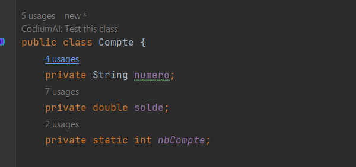
2. Ajout du constructeur
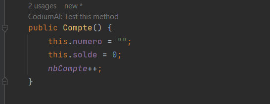
3. Création des getter et setter
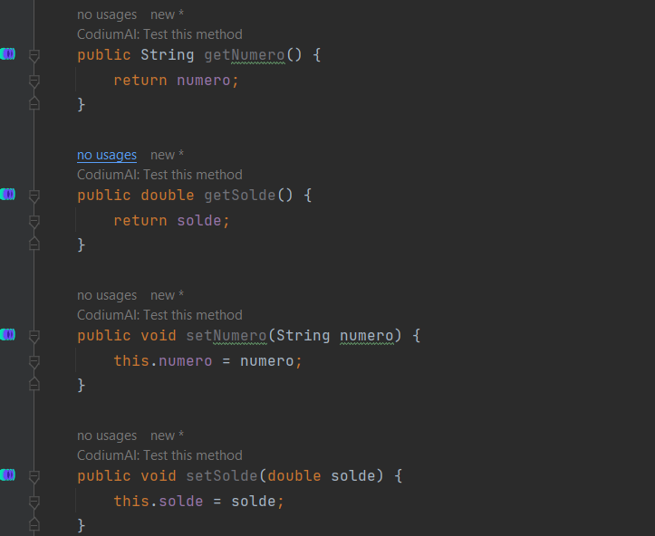
4. Création de la méthode déposer
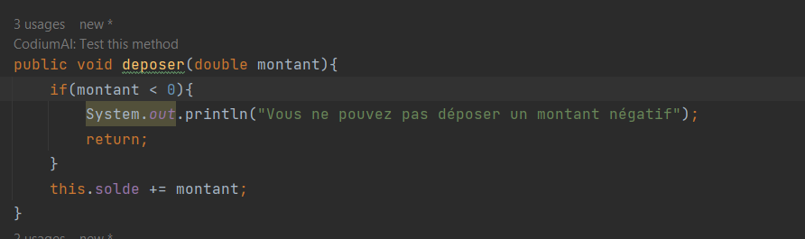
5. Création de la méthode retirer
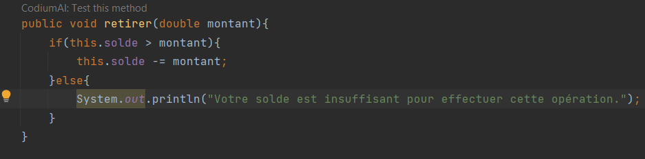
6. Méthode afficherCompteInfo
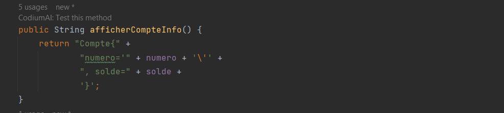
7. Création d'une méthode statique afficherNbComptes
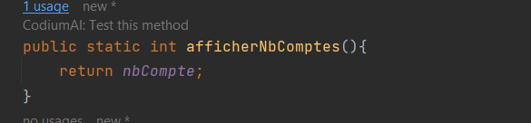
8. Compte main
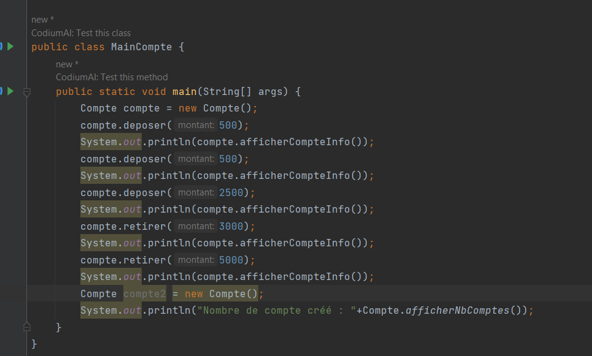
<h3>Excercice 2</h3>
1. Création class personne
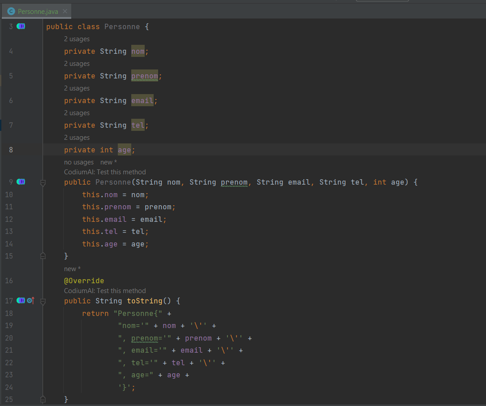
2. Création de la class Adherent qui hérite de la class personne
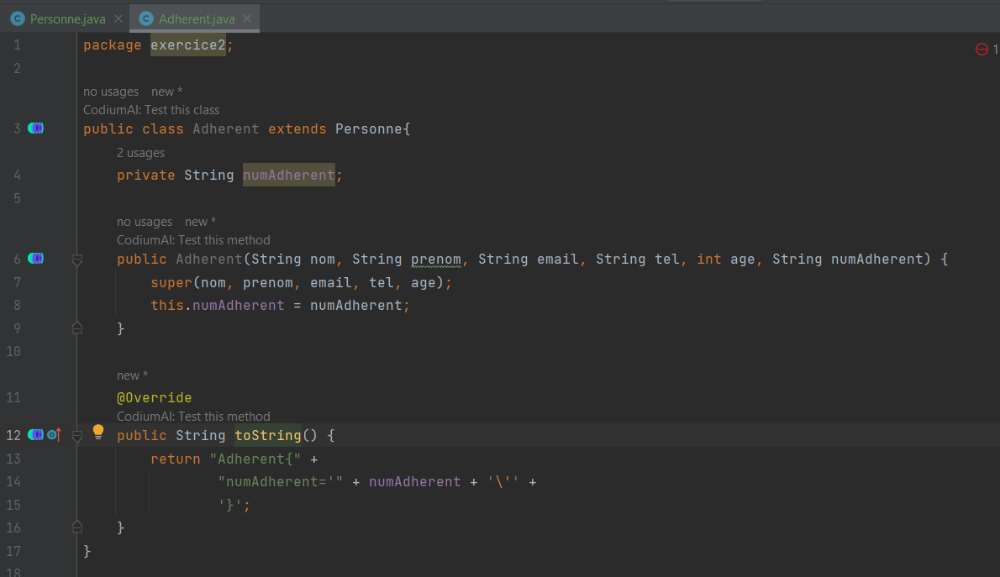
3. Création Auteur qui hérite de la class personne
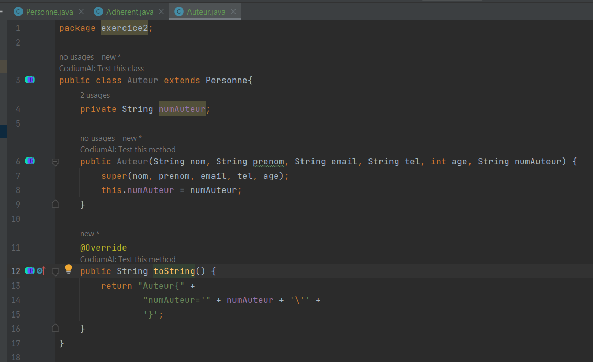
4. Création de la class livre
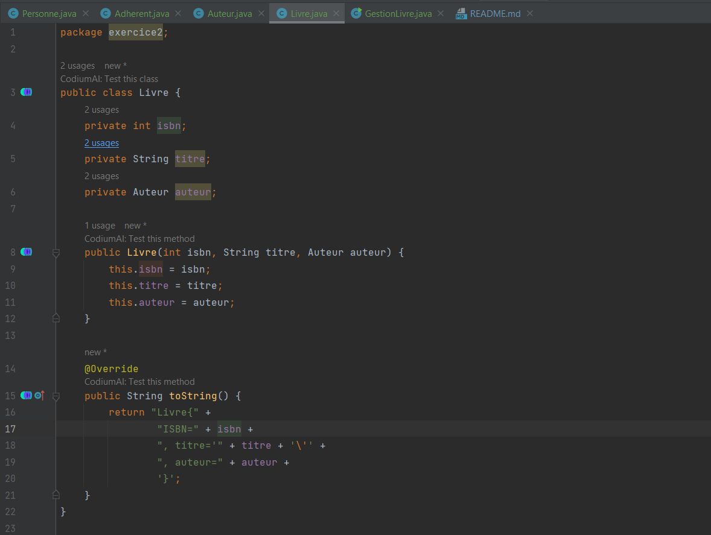
5. Création de la méthode main:
   - Déclarer et instensier un adhérent
   - Déclarer et instensier un livre
   - Afficher les informations de l'adhérent et du livre
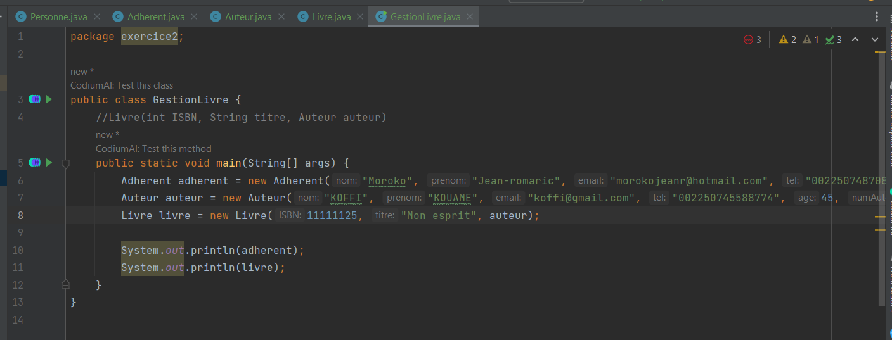
<h3>Excercice 3</h3>
1. Création class Vehicule
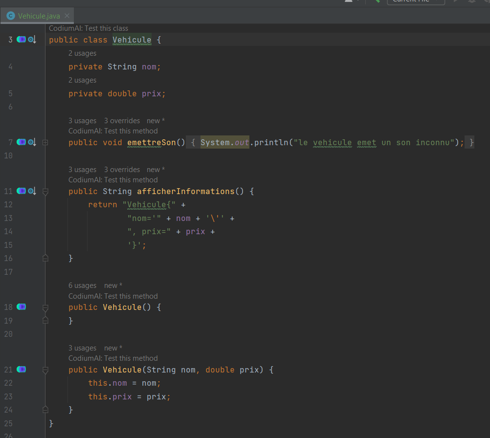
2. Création de la class Voiture qui hérite de la class Vehicule
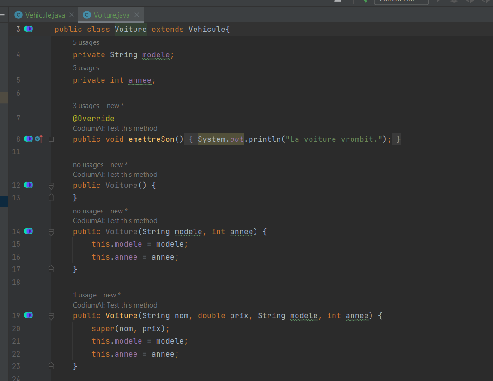
3. Création class Moto qui hérite de la class Vehicule
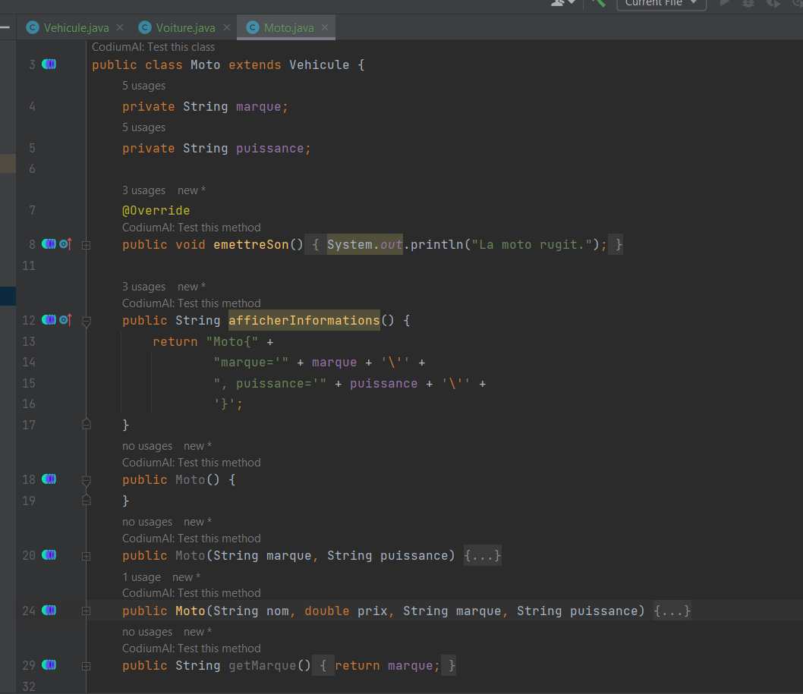
4. Création de la class Avion qui hérite de la class Vehicule
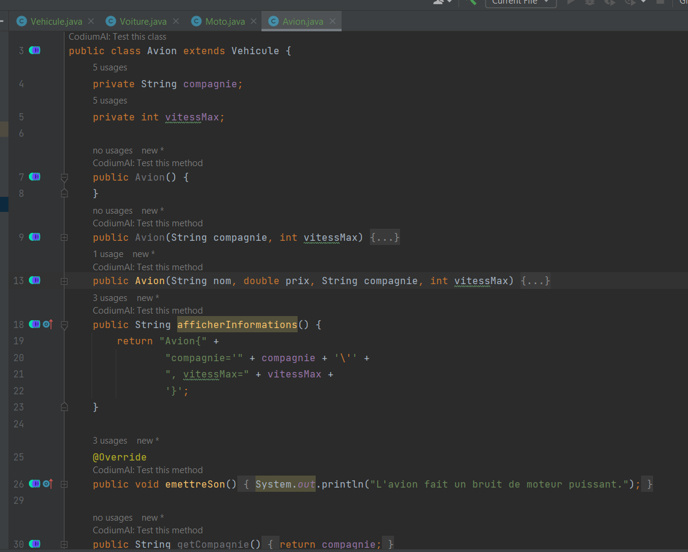
5. Création de la méthode main:
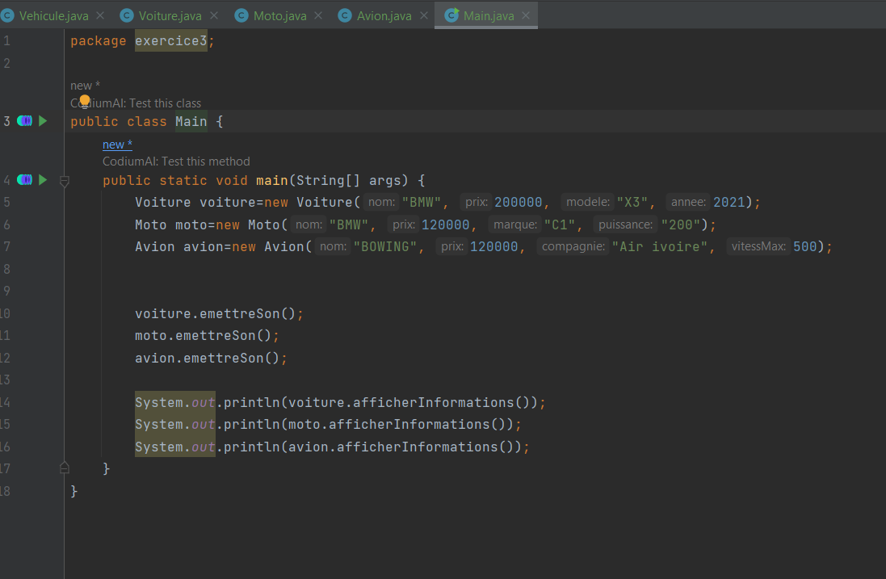

