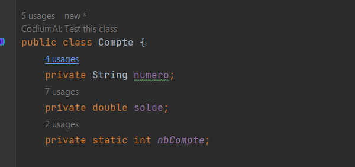
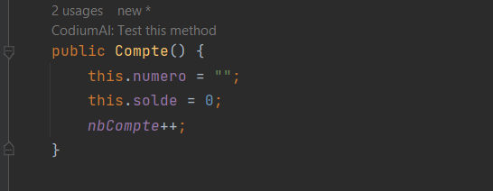
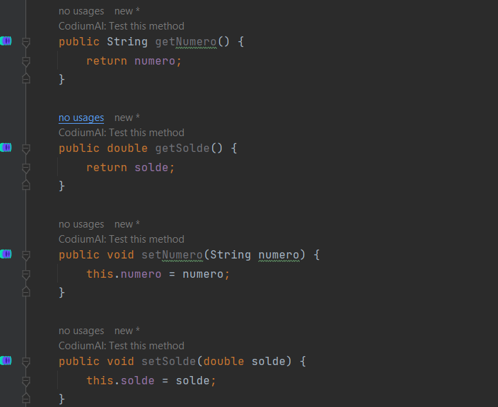
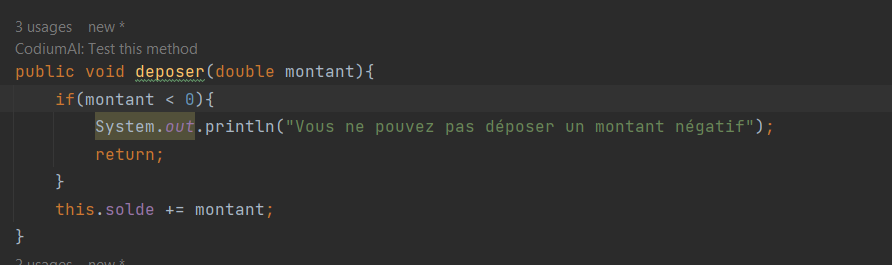
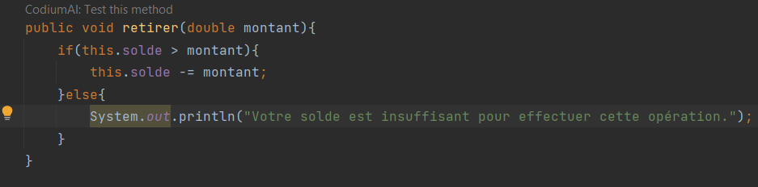
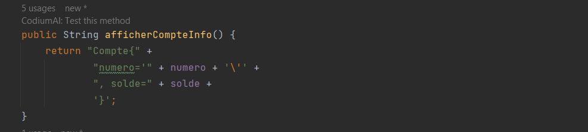
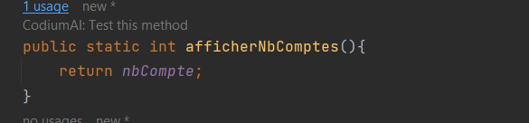
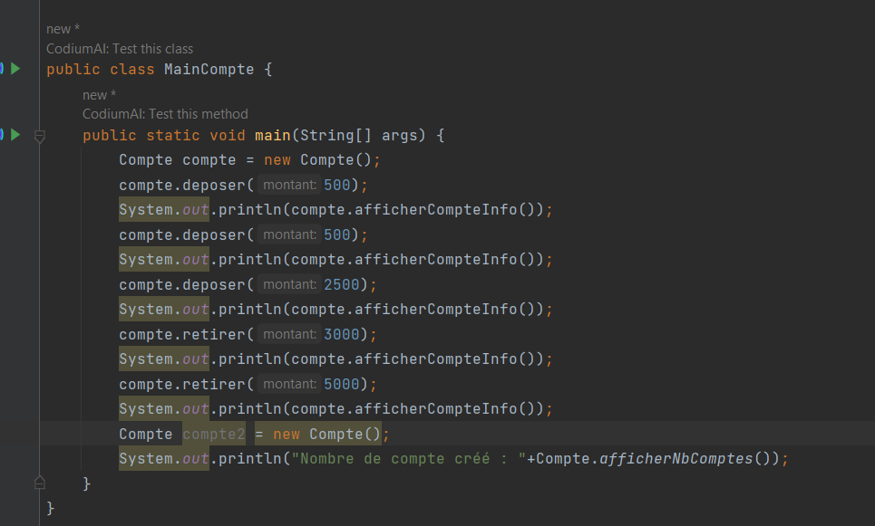

<h1>Activité pratique: Membres, Héritage et redéfinition.</h1>

<h3>Excercice 1</h3>
1. Création de la class Compte

2. Ajout du constructeur

3. Création des getter et setter

4. Création de la méthode déposer

5. Création de la méthode retirer

6. Méthode afficherCompteInfo

7. Création d'une méthode statique afficherNbComptes

8. Compte main
